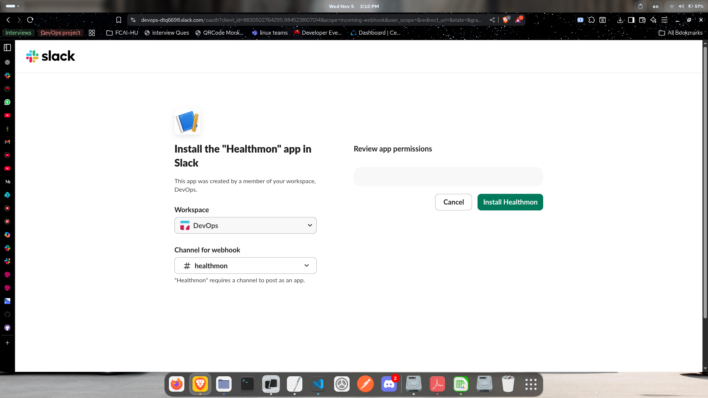
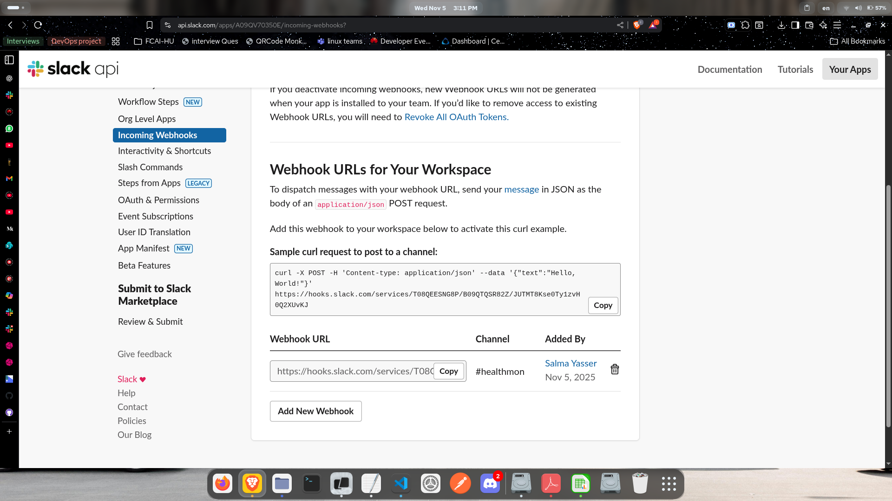

# 🩺 HealthMon — Simple Server Health Monitoring Script

**HealthMon** is a lightweight Bash script for monitoring key server resources (CPU, RAM, and Disk).  
It checks system usage against defined thresholds and can send alerts via **email** or **Slack**, while also logging results to a JSON-formatted log file.

---

## 📁 File Overview

| File                     | Description                                     |
| ------------------------ | ----------------------------------------------- |
| `/etc/healthmon.conf`    | Configuration file (defines default thresholds) |
| `/var/log/healthmon.log` | Log file where all health checks are recorded   |
| `healthmon.sh`           | The main monitoring script                      |

---

## ⚙️ 1. Configuration File (`/etc/healthmon.conf`)

The script loads thresholds from `/etc/healthmon.conf` if it exists.  
If the file is missing, it uses built-in defaults.

### Example Configuration:

```bash
# /etc/healthmon.conf
CPU=80
RAM=75
DISK=90

```

If these variables are not found, the script will automatically fall back to:

```sh
CPU=80
RAM=70
DISK=85
```

---

## 🧠 2. Command-Line Arguments

HealthMon accepts multiple command-line options to modify its behavior.

| Option                     | Description                                        |
| -------------------------- | -------------------------------------------------- |
| `--silent`                 | Runs quietly — prints only alerts, not OK messages |
| `--email`                  | Enables email alerts (uses `mail` command)         |
| `--slack`                  | Sends alerts to a Slack channel via webhook        |
| `--threshold METRIC=value` | Override specific metric threshold for this run    |

### Example Usage:

```bash
./healthmon.sh --silent --email --threshold CPU=85 --threshold RAM=75
```

This example:

- Runs in silent mode
- Sends alerts via email
- Sets CPU threshold to **85%** and RAM threshold to **75%** for this execution only

---

## 🖥️ 3. System Usage Collection

The script uses standard Linux commands to fetch usage metrics:

| Metric   | Command Used | Example Output   |
| -------- | ------------ | ---------------- |
| **CPU**  | `mpstat`     | `2.94` (used %)  |
| **RAM**  | `free -h`    | `56.67` (used %) |
| **DISK** | `df /`       | `26` (used %)    |

### Functions:

```bash
cpu_usage()   # Calculates CPU used percentage
ram_usage()   # Calculates RAM used percentage
disk_usage()  # Calculates root partition usage
```

Each function returns a **numeric percentage** without symbols (safe for comparison).

---

## ⚖️ 4. Threshold Checking

The `check_threshold()` function compares the current usage with the configured threshold using `bc` for floating-point math.

If usage exceeds the threshold → an alert is triggered.  
Otherwise → it logs an “OK” message (unless in silent mode).

```bash
check_threshold "CPU" "$CPU_NOW" "$CPU"
```

Example output:

```
CPU usage OK: 2.94%
RAM usage OK: 56.67%
DISK usage OK: 26%
```

If an alert triggers:

```
ALERT: RAM usage is 91.00% (threshold 75%)
```

---

## 🧾 5. JSON Logging

Each result is appended to `/var/log/healthmon.log` in JSON format for easy parsing.

### Example Log Entry:

```json
{
  "timestamp": "2025-11-05T09:12:21Z",
  "metric": "RAM",
  "value": 58.0,
  "threshold": 70,
  "status": "OK"
}
```

Logs include:

- **timestamp (UTC)**
- **metric** name (CPU, RAM, or DISK)
- **measured value**
- **threshold value**
- **status** (OK / ALERT)

---

## 📢 6. Alerts

### 📨 Email Alerts

If `--email` is enabled, alerts are sent using the system `mail` command:

```bash
echo "$message" | mail -s "HealthMon Alert: $metric" user@example.com
```

You can change the recipient (default: current user).

---

### 💬 Slack Alerts

If `--slack` is provided, alerts are sent to a Slack webhook:

To use this: <br>
A. Create a Slack **Incoming Webhook** URL. <br>

B. Replace it in the script under `send_alert()`. <br>

## A- Creating slack webhook

1. open this url 👉 https://api.slack.com/apps
2. Click “Create New App”
3. Choose “From scratch”
4. Give it a name (e.g. HealthMon Alerts)
5. Select the Slack workspace where you want to post messages
   
6. After the app is created, go to “Features” → “Incoming Webhooks” in the left sidebar
7. Switch “Activate Incoming Webhooks” to ON
   
8. Scroll down and click “Add New Webhook to Workspace”
9. Choose the channel (for example, #alerts or #general)
10. Click “Allow”
    
11. Copy the Webhook URL
    

## B. Replace url in the script under `send_alert()`.

```bash
curl -s -X POST -H 'Content-type: application/json'   --data "{"text": "$message"}"   https://hooks.slack.com/services/XXXXXXXXX/YYYYYYYYY/ZZZZZZZZZZZZZZZZZZZZZZ
```

---

## 🧩 7. Execution Flow Summary

1. Load config file `/etc/healthmon.conf`
2. Parse any command-line overrides
3. Measure CPU, RAM, and Disk usage
4. Compare against thresholds
5. Log JSON results to `/var/log/healthmon.log`
6. Send alerts if thresholds are exceeded
7. Print output (unless `--silent`)

---

## 🧰 Example Run

```bash
./healthmon.sh --threshold CPU=75 --slack
```

Output:

```
CPU usage OK: 22.45%
RAM usage OK: 61.33%
DISK usage OK: 28%
```

And in case of alert:

```
ALERT: RAM usage is 91.20% (threshold 75%)
```

---

## 🔒 Permissions & Setup

Ensure the script has execution permission:

```bash
sudo chmod +x /usr/local/bin/healthmon.sh
```


Create required files if missing:

```bash
sudo touch /etc/healthmon.conf /var/log/healthmon.log
sudo chmod 644 /etc/healthmon.conf
sudo vim /etc/healthmon.conf  # add the threshold values
sudo chmod 666 /var/log/healthmon.log
```

## 

## 🕒 Systemd Service & Timer Setup

Use systemd to automatically run the HealthMon script at fixed intervals.

1. Create the Service Unit

Create a file at:
/etc/systemd/system/healthmon.service

```bash
[Unit]
Description=HealthMon - Server Health Monitoring Script

[Service]
Type=oneshot   # This tells systemd to run your script once not keep it running in the background
ExecStart=/usr/local/bin/healthmon.sh --silent --email
```

2. Create the Timer Unit

Create another file at:
/etc/systemd/system/healthmon.timer

```bash
[Unit]
Description=Run HealthMon every 5 minutes

[Timer]
OnUnitActiveSec=5min  # This timer triggers the service every 5 minutes.

[Install]
WantedBy=timers.target
```

3. Restart daemon and enable service

   

---

## Verification

1.  Check the timer logs before trigger 

    
2.  Check the timer logs After trigger

    
3.  Check the Service logs After trigger

    
4.  Check the logs After trigger

    
5.  Check the logs After trigger with alerts
    - Alert on **mail** :

      
    - Alert on **Slack**

      

---

## 🧾 Example JSON Logs
- Logs **Before** alert 


- Logs **After** alert 


---

## ✅ Summary

HealthMon is:

- 🪶 Lightweight (pure Bash, no dependencies)
- 📊 Configurable thresholds
- 🔔 Optional Slack & Email alerts
- 🧾 JSON-based logging for integration

## ✅ Improvements & Enhancements
Tutorial link :  https://medium.com/@basitjawaid123/building-a-bash-script-to-monitor-server-performance-my-journey-891e68b13a49

1. Config file + default thresholds

    - We added a separate configuration file (/etc/healthmon.conf) so thresholds for CPU, RAM, DISK can be configured and persisted.
    - We also introduced fallback default values if the config file is missing.
    - The tutorial focuses more on displaying metrics, but ours supports thresholds + alerts.

2. Threshold-based monitoring + alerts

    - The tutorial script shows stats and top processes but doesn’t include a threshold comparison or alerting mechanism.
    - Our version includes a check_threshold() function that compares current value vs configured threshold, logs JSON, and triggers alerts via email/Slack.

3. JSON logging of results

    - In addition to console output, we log each metric check in JSON format: timestamp, metric, value, threshold, status (“OK” or “ALERT”).
    - That makes it easier for downstream tools (e.g., aggregators, dashboards) to parse.
    - The tutorial does not include structured JSON logging.

3. Support for multiple alert channels (email + Slack + console) & silent mode

    - We allow flags like --email, --slack, --silent to control how alerts and output behave.
    - This flexibility makes the script usable both interactively and non-interactively (e.g., in a service).
    - The tutorial script has display logic but no multi-channel alerting or silent mode.

5. Better command-line argument parsing and overrides

    - We support --threshold CPU=85, allow different order of arguments, and combine it with config file default settings.
    - Our version has greater flexibility.

6. Use of systemd service + timer support (instead of just cron)

    - We provide instructions for using a healthmon.service + healthmon.timer under systemd, which is more modern and integrates with the OS service manager.
    - The tutorial mentions manual script execution or cron but doesn’t go into service/timer usage.